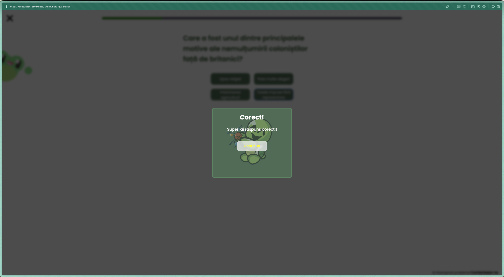

# Smart Learning - Learn the USA history easier

Hello there! This is a project i've made a while ago, around march 2025 for a competition. Its purpose was to help students learn the history of the USA easier!

## What's the tech stack?

I choose to go with a more simpler approach for this one, hence no backend was required. I've used HTML, CSS and vanilla JS. For the quiz system, i've used vanilla JS as well. I was planning on doing something with JQuery but i've abandoned the idea and went with an easier approach :)

Additional libraries used: [remixicons](https://remixicon.com/), [swiper](https://swiperjs.com/), [scrollreveal](https://scrollrevealjs.org/)

## The Quiz System

The quiz system is located in the ``./quiz`` directory. You can add any quiz to it by using a JSON file! Every quiz made using a specific JSON file will be located at ``domain.com/quiz/index.html?quiz=json_file_name``. You can check the format of the other quizes in order to implement your own. 

The quiz system is designed to accept exactly **5 questions** (i'll probably release a more extensible version of it, since the quiz system i'm using right was made in 2022, back when i didn't had that much experience).

The main javascript file of the quiz system is the ``system.js`` file. There are still a few bugs but you can have a go and check the code!

Here are a few screenshots of a quiz:

Quiz main interface:

Quiz modal:

The quiz system, like i said, is relatively old. Please feel free to open an issue or make a push request if you have any ideas for improvements!

## Thank you! :D

*Some web assets were taken from tutorials on youtube, so if you find some bugs regarding responsiveness plz let me know!*